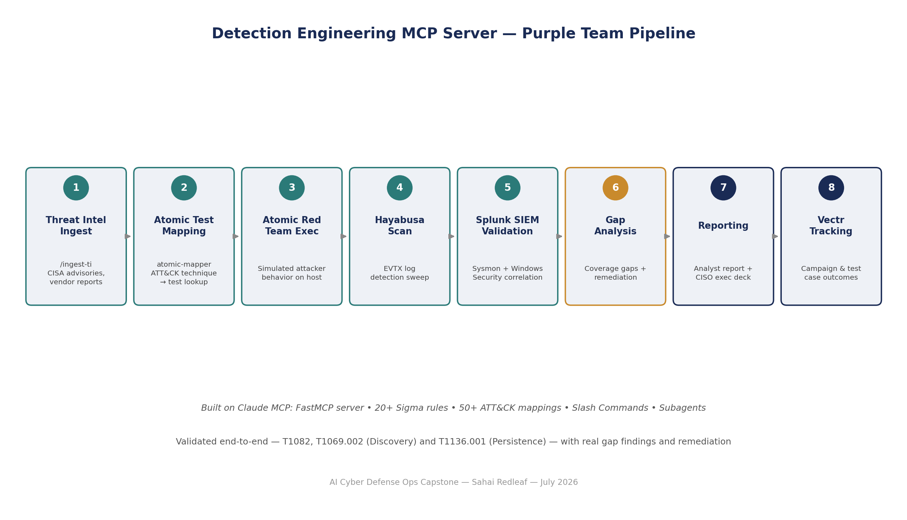

# Detection Engineering MCP Server

A Model Context Protocol (MCP) server that gives Claude integrated detection 
engineering capabilities — log analysis, threat intelligence processing, and 
detection rule management — built as the capstone project for the AI Cyber 
Defense Ops program (WiCyS / Just Hacking Training). Certificate issued July 2026.

📄 [Full capstone report (PDF)](./AI-Cyber-Defense-Ops-Capstone-Report.pdf)

## What It Does

The platform turns threat intelligence into testable, measurable detection 
coverage. It combines:

- **MCP server architecture** — FastMCP-based server exposing 6+ tools and 5+ 
  resource types to Claude
- **Detection knowledge base** — 20+ production Sigma rules mapped to 50+ 
  MITRE ATT&CK techniques
- **Threat intelligence pipeline** — automated extraction of TTPs, IOCs, and 
  simulation plans from threat reports (`/ingest-ti`)
- **Multi-source investigation** — correlates Sysmon and Windows Security logs 
  with Splunk (`/query`, `/hunt`)
- **Coverage analysis** — quantifies detection gaps and validates rule coverage 
  against real attack scenarios
- **Purple team integration** — runs and analyzes Atomic Red Team tests against 
  the detection rules

## Purple Team Validation (July 2026)

Ran a full end-to-end purple team loop against a real threat campaign 
(Huntress report — ClickFix + Matanbuchus 3.0 + AstarionRAT):

1. **Ingested threat intel** — extracted 10+ techniques across Discovery, 
   Execution, Persistence, and C2 tactics
2. **Executed atomic tests** for T1082 (System Information Discovery) and 
   T1069.002 (Domain Groups Discovery)
3. **Scanned with Hayabusa** — 46,900+ EVTX detections across Security and 
   Sysmon logs
4. **Validated in Splunk** — confirmed both techniques fully captured in Sysmon
5. **Found a real gap** — Windows Security EventCode 4688 (Process Creation) 
   was not enabled, meaning Discovery-phase commands were invisible to Windows 
   Security auditing despite being caught in Sysmon
6. Separately validated **T1136.001** (local account creation → privilege 
   escalation → cleanup) — fully detected end-to-end with zero gaps

## Key Metrics

| Metric | Value |
|---|---|
| Sigma rules written | 20+ |
| ATT&CK techniques mapped | 50+ |
| Threat intel reports ingested | 1 (CISA AA26-194A) |
| Credential access hunts | 7 |
| Purple team tests executed | 3 techniques |

## Reporting

Produced both an analyst-level report (execution timeline, SIEM validation, 
gap analysis, SPL queries) and a CISO-ready executive deck (coverage metrics, 
key findings, remediation priorities) — practicing translating technical 
findings for both technical and executive audiences.

## Notes

Built as the capstone project for AI Cyber Defense Ops (WiCyS / Just Hacking 
Training, Module 10+: Purple Team & Multi-Agent Workflows). All personal 
identifiers and credentials have been sanitized — machine names appear as 
HOST-A/HOST-B, usernames as USER-A/USER-B.
